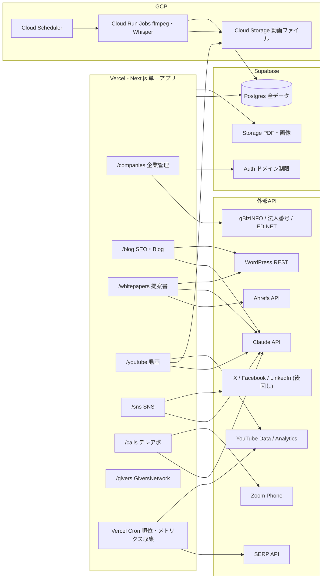
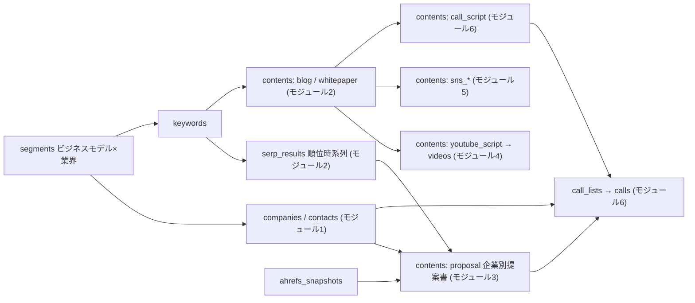

# AirERP Marketing Cloud - システム構成

## 決定事項

- 単一Next.jsアプリ(App Router)をVercelにデプロイ。モジュールはルートグループで分割
- データ・認証・ストレージはSupabaseに一元化(Airtable / Stackerは不使用)
- 動画処理など重いバッチのみGCP(Cloud Run Jobs + Cloud Storage + Cloud Scheduler)
- 軽い定期処理(SERP取得・メトリクス収集)はVercel Cron
- コンテンツ生成はClaude API、公開前に必ず人間レビュー(contents.status で制御)
- 利用者は社内メンバーのみ(Supabase Authでドメイン制限)

## システム相関図

## データフロー(モジュール間の依存)

ポイント:

- `segments`(ビジネスモデル×業界)が全モジュールの起点。
- 生成物はすべて `contents` 1テーブル(type別)。Blog→YouTube台本→SNS投稿→架電スクリプトの派生関係は `parent_content_id` で追える。
- `serp_results` はSERP上位N件を全行保存する。自社順位(モジュール2)もターゲット企業の順位(モジュール3)も同じデータからdomainマッチで導出でき、API取得が二重にならない。
- 架電拒否は `calls.result = 'refused'` のトリガーで `do_not_contact` に自動反映し、以後のリスト生成から除外される(個人情報運用ルールのオプトアウト対応)。
- 接点履歴は `activities` に集約し、企業詳細画面で1本のタイムラインとして表示する。

## テーブル一覧(全文は schema.sql)

| モジュール | テーブル | 役割 |
|---|---|---|
| 共通 | profiles | 社内ユーザー(Supabase Auth連携) |
| 1 | business_models / industries / segments | 攻略単位の定義 |
| 1 | companies / contacts / company_relations | 企業・担当者・ベンダー/投資家 |
| 2 | keywords / tracking_settings / serp_results | キーワードと順位時系列(取得量は後から変更可) |
| 3 | ahrefs_snapshots | Ahrefs調査データ |
| 2-6 | contents / content_assets | 全生成物とPDF・画像 |
| 4 | videos / video_metrics | 動画と再生データ |
| 5 | sns_metrics | SNS表示データ |
| 6 | call_lists / call_list_items / calls | 架電リストと通話ログ |
| 横断 | activities | 企業別タイムライン |
| 7 | (givers スキーマ) | GiversNetworkを別スキーマで移植 |

## 実装順

1. フェーズ1: segments + 企業管理(モジュール1)
2. フェーズ2: キーワード・SERP・Blog生成・WordPress投稿(モジュール2)
3. フェーズ3: 架電リスト・スクリプト・Zoom Phone連携(モジュール6)
4. フェーズ4以降: 提案書(3)→ YouTube(4)→ SNS(5)→ GiversNetwork移植(7)
